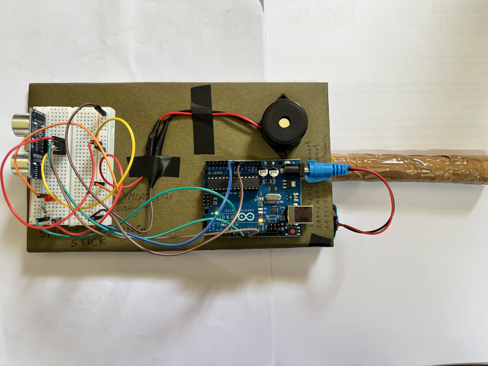
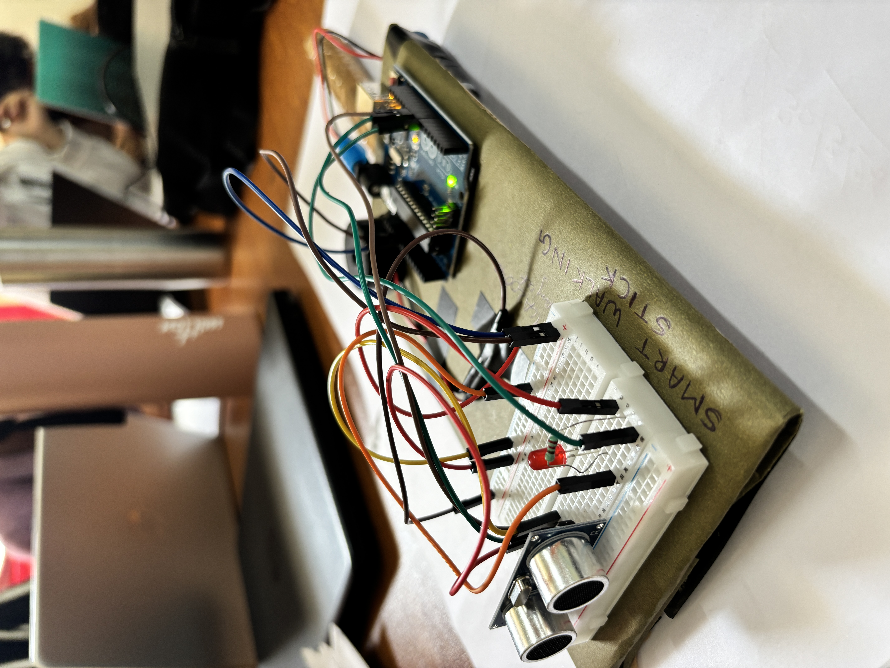
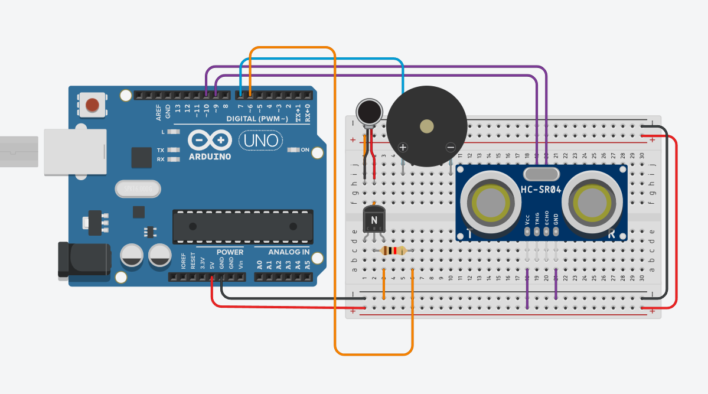

# 🦯 Smart Blind Walking Stick

> An IoT-powered assistive device that helps visually impaired individuals navigate safely and independently using ultrasonic obstacle detection.


---

## 📌 Overview

The **Smart Blind Walking Stick** is an intelligent assistive device built using **Arduino Uno** and an **HC-SR04 Ultrasonic Sensor**. Unlike traditional white canes that detect obstacles only on contact, this device provides **advance warning** through audio (buzzer) and visual (LED) alerts — giving users more time to react and navigate safely.

The alert frequency is **distance-proportional**:
- 🔴 **< 20 cm** → Fast beeping (danger zone)
- 🟡 **20–50 cm** → Slow beeping (caution zone)
- 🟢 **> 50 cm** → No alert (safe zone)

---

## 📸 Project Photos





> 📹 Demo video coming soon!

---

## ✨ Features

- **Non-contact obstacle detection** up to 50 cm range
- **Variable-speed alerts** based on obstacle proximity
- **Dual alert system** — buzzer (audio) + LED (visual)
- **Battery-powered** — fully portable and standalone
- **Low-cost** — built with affordable, widely available components
- **Expandable** — designed for future upgrades (vibration motor, GPS, voice guidance)

---

## 🛠️ Hardware Components

| Component | Quantity |
|-----------|----------|
| Arduino Uno R3 | 1 |
| Ultrasonic Sensor (HC-SR04) | 1 |
| Piezo Buzzer | 1 |
| LED | 1 |
| Resistor 220Ω | 1 |
| Breadboard | 1 |
| Jumper Wires (Male-Male) | As required |
| 9V Battery + Connector | 1 |
| USB A to B Cable | 1 |
| Blind Stick / Support Frame | 1 |

---

## 💻 Software & Tools

- **Arduino IDE** — Code development and upload
- **Embedded C / Arduino Language** — Programming
- **Tinkercad Circuit Simulator** — Circuit design and simulation
- **Windows OS** — Development environment

---

## 🔌 Circuit Connections

```
HC-SR04 Ultrasonic Sensor:
  VCC  →  5V (Arduino)
  GND  →  GND (Arduino)
  TRIG →  Pin 9
  ECHO →  Pin 10

Buzzer:
  Positive  →  Pin 7
  Negative  →  GND

LED:
  Anode (+)   →  Pin 7 (through 220Ω resistor)
  Cathode (–) →  GND

Power:
  USB cable (programming/testing)
  9V Battery with barrel jack (standalone)
```

---

## 📟 Source Code

```cpp
#define trigPin 9
#define echoPin 10
#define buzzer  7
#define motor   6

long duration;
int distance;

void setup() {
  pinMode(trigPin, OUTPUT);
  pinMode(echoPin, INPUT);
  pinMode(buzzer,  OUTPUT);
  pinMode(motor,   OUTPUT);
  Serial.begin(9600);
}

void loop() {
  // Trigger ultrasonic pulse
  digitalWrite(trigPin, LOW);
  delayMicroseconds(2);
  digitalWrite(trigPin, HIGH);
  delayMicroseconds(10);
  digitalWrite(trigPin, LOW);

  // Read echo and calculate distance
  duration = pulseIn(echoPin, HIGH);
  distance = duration * 0.034 / 2;

  Serial.print("Distance: ");
  Serial.println(distance);

  // Distance alert logic
  if (distance > 0 && distance < 20) {
    // VERY CLOSE → fast beep
    digitalWrite(buzzer, HIGH);
    digitalWrite(motor, HIGH);
    delay(100);
    digitalWrite(buzzer, LOW);
    digitalWrite(motor, LOW);
    delay(100);
  }
  else if (distance >= 20 && distance < 50) {
    // NEAR → slow beep
    digitalWrite(buzzer, HIGH);
    digitalWrite(motor, HIGH);
    delay(400);
    digitalWrite(buzzer, LOW);
    digitalWrite(motor, LOW);
    delay(400);
  }
  else {
    // SAFE → no alert
    digitalWrite(buzzer, LOW);
    digitalWrite(motor, LOW);
  }

  delay(50);
}
```

---

## ⚙️ How It Works

```
┌─────────────────────────────────────────────────────┐
│                    SYSTEM FLOW                      │
│                                                     │
│  HC-SR04 sends ultrasonic pulse                     │
│       ↓                                             │
│  Echo received → Arduino calculates distance        │
│       ↓                                             │
│  Distance < 20cm  → Fast buzzer + LED alert         │
│  Distance 20-50cm → Slow buzzer + LED alert         │
│  Distance > 50cm  → No alert (safe path)            │
└─────────────────────────────────────────────────────┘
```

1. The **HC-SR04 sensor** emits a 40kHz ultrasonic pulse every 50ms
2. The pulse reflects off nearby obstacles and returns to the sensor
3. **Arduino** calculates distance using: `distance = duration × 0.034 / 2`
4. Based on distance, buzzer and LED are activated at appropriate speeds
5. The user interprets alert frequency to gauge proximity of obstacles

---

## 📊 Test Results

| Scenario | Expected Behavior | Observed Result |
|----------|-------------------|-----------------|
| Object < 20 cm | Fast beeping | ✅ Pass |
| Object 20–50 cm | Slow beeping | ✅ Pass |
| No object nearby | No alert | ✅ Pass |
| Battery-powered operation | Standalone function | ✅ Pass |
| Tinkercad simulation | Correct behavior | ✅ Pass |

---

## 🚀 Future Enhancements

- [ ] Vibration motor for tactile feedback
- [ ] GPS module for real-time location tracking
- [ ] Voice guidance using DFPlayer Mini
- [ ] Water/pit detection sensor at ground level
- [ ] Bluetooth connectivity for caregiver alerts
- [ ] Rechargeable lithium battery integration
- [ ] Compact PCB design for stick mounting


---

## 🎓 Academic Details

| Field | Details |
|-------|---------|
| Student | Taranjeet Singh |
| Roll No | 24MCA20073 |
| Section | 24MCA4/A |
| Guide | Mr. Gaurav Mehta (E14354) |
| Institute | University Institute of Computing, Chandigarh University |
| Course | MCA — Internet of Things (IoT) |

---

## 📄 License

This project is licensed under the MIT License — feel free to use, modify, and distribute with attribution.

---

## 🤝 Connect

If you found this project helpful or want to collaborate, feel free to connect!

[](www.linkedin.com/in/taranjeet-singh-b5ab0b255)
[](https://github.com/Nix0123)

---

*Built with ❤️ to make the world more accessible.*
